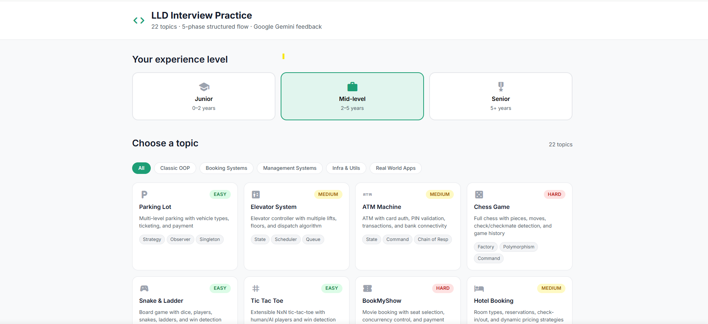
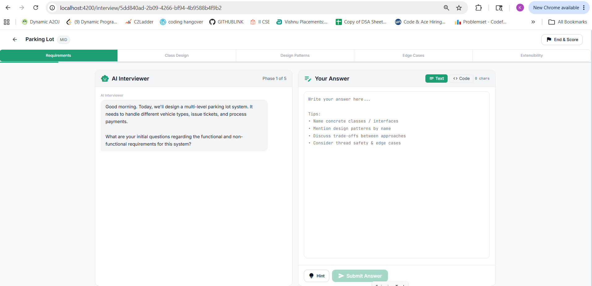
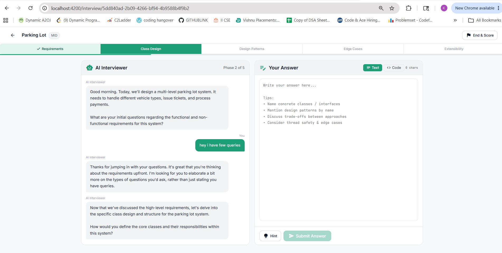
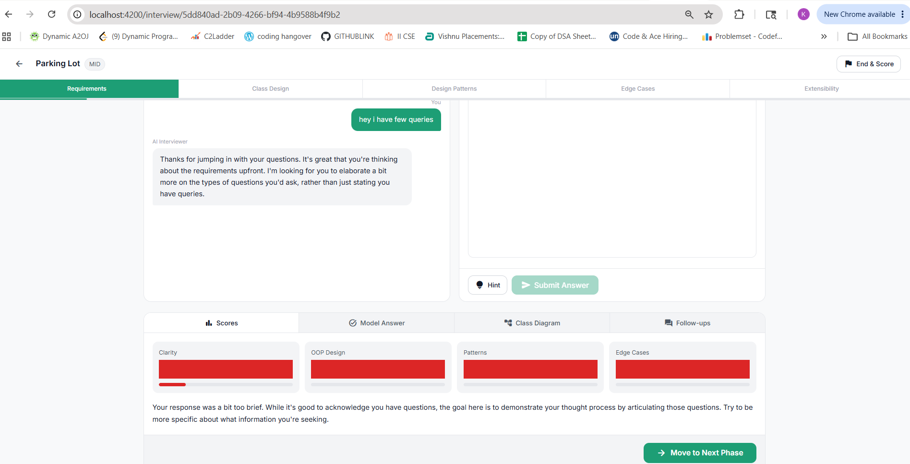
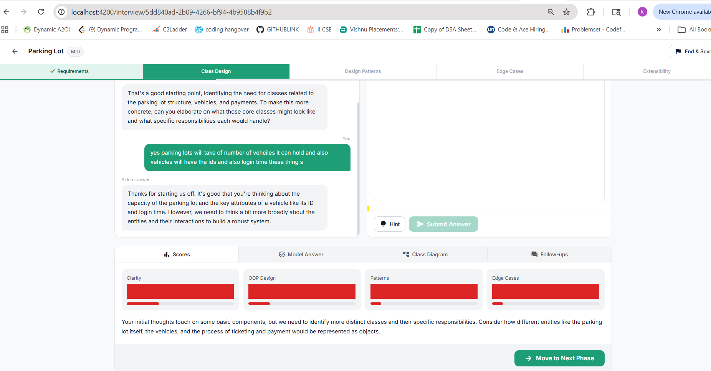
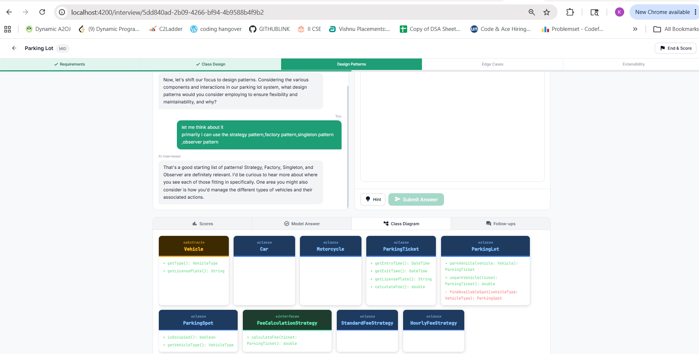
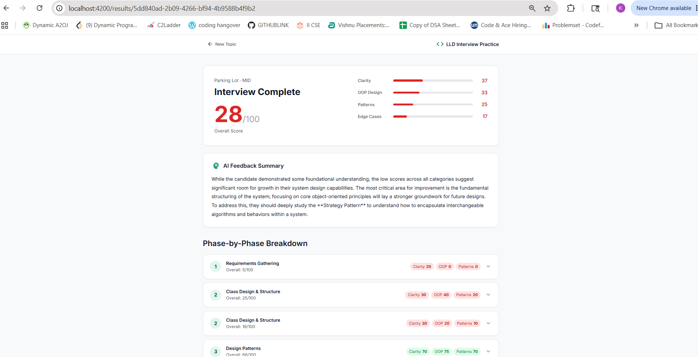

# LLD Interview Platform

> An AI-powered Low Level Design interview simulator that coaches you through real system design interviews — phase by phase, with live feedback, class diagrams, and a scoring breakdown.


---

## What it does

Pick an LLD topic (Parking Lot, Rate Limiter, BookMyShow, etc.), choose your experience level, and get put through a **5-phase structured interview** by an AI interviewer. After each answer you receive:

- A conversational reply from the AI acknowledging your specific points
- Scores across Clarity, OOP Design, Patterns, and Edge Cases
- A model answer with bullet-point guidance
- A **UML class diagram** generated for your design
- Follow-up questions to push your thinking deeper

When you're ready, hit **Move to Next Phase** — the AI opens the next phase with a fresh question. At the end you get a full session report with per-phase breakdowns and an overall score.

---

## Screenshots

**Topic Selection — pick your topic and experience level**


**Interview Screen — AI interviewer opens Phase 1**


**Conversational Flow — AI responds to your answers in real time**


**Feedback Panel — scores, model answer, and Move to Next Phase**


**Class Diagram — UML boxes auto-generated from your design**


**Design Patterns Phase — colored UML with member visibility**


**Results Page — overall score, AI summary, phase-by-phase breakdown**


---

## Features

| Feature | Detail |
|---|---|
| 5-phase interview flow | Requirements → Class Design → Patterns → Edge Cases → Extensibility |
| 22 LLD topics | Classic OOP, Booking, Management, Infra, Real-World categories |
| Conversational AI feedback | Gemini replies as a real interviewer, not a rubric |
| Live UML class diagram | Color-coded boxes by type (class / interface / abstract / enum) |
| Code snippet mode | Monaco editor (VS Code engine) with language selector |
| Typewriter effect | AI responses render character-by-character |
| Scoring & session report | 4-axis scores + overall, per-phase breakdown, AI summary |
| Hint system | 3-bullet nudge without giving the answer away |
| Docker support | `docker compose up` — no local Java/Node required |

---

## Tech Stack

| Layer | Technology |
|---|---|
| Backend | Spring Boot 3.2, Java 17 |
| AI Integration | Spring AI 1.0.0 (`ChatClient` — OpenAI-compatible adapter) |
| AI Model | Google Gemini `gemini-3.1-flash-lite` — 500 RPD free tier |
| Database | H2 in-memory (dev) — swappable to PostgreSQL |
| ORM | Spring Data JPA + Hibernate |
| Frontend | Angular 17, standalone components, Signals API |
| Code editor | Monaco Editor (CDN) |
| Styling | SCSS, CSS custom properties (dark/light theme-ready) |

---

## Architecture

```
┌─────────────────────────────────────────────────────────┐
│                      Browser                            │
│  Angular 17 (Signals, Standalone Components)            │
│  ┌──────────┐  ┌─────────────────┐  ┌───────────────┐  │
│  │  Home    │  │   Interview      │  │   Results     │  │
│  │  (topic  │  │  (chat + editor  │  │  (score &     │  │
│  │  picker) │  │   + UML viewer)  │  │   breakdown)  │  │
│  └──────────┘  └─────────────────┘  └───────────────┘  │
└────────────────────────┬────────────────────────────────┘
                         │ REST (JSON)
┌────────────────────────▼────────────────────────────────┐
│                 Spring Boot 3.2                          │
│  InterviewController  →  InterviewService               │
│                               │                         │
│                       GeminiAiService                   │
│                   (Spring AI ChatClient)                │
└────────────────────────┬────────────────────────────────┘
                         │ OpenAI-compatible endpoint
          ┌──────────────▼──────────────┐
          │      Google Gemini API      │
          │  gemini-3.1-flash-lite      │
          │  (500 RPD free tier)        │
          └─────────────────────────────┘
```

---

## Quick Start

### Prerequisites

- Java 17+
- Node.js 18+ and npm
- A free [Google Gemini API key](https://aistudio.google.com/app/apikey)

---

### 1 — Backend

```bash
cd backend

# Linux / macOS
export GEMINI_API_KEY=your_key_here
./mvnw spring-boot:run

# Windows PowerShell
$env:GEMINI_API_KEY="your_key_here"
./mvnw spring-boot:run
```

Backend starts at **http://localhost:8080**

> H2 console (dev): http://localhost:8080/h2-console — JDBC URL: `jdbc:h2:mem:llddb`

---

### 2 — Frontend

```bash
cd frontend
npm install
npm start
```

Frontend starts at **http://localhost:4200**

---

### Docker (one command)

```bash
# Set your key in the environment, then:
GEMINI_API_KEY=your_key_here docker compose up --build
```

- Frontend → http://localhost:4200
- Backend  → http://localhost:8080

---

## Configuration

All backend settings live in `backend/src/main/resources/application.yml`.

| Property | Default | Description |
|---|---|---|
| `GEMINI_API_KEY` env var | *(required)* | Your Gemini API key |
| `spring.ai.openai.chat.options.model` | `models/gemini-3.1-flash-lite` | Gemini model via Spring AI |
| `spring.ai.openai.base-url` | Gemini OpenAI-compatible endpoint | Swap to use any OpenAI-compatible model |
| `cors.allowed-origins` | `http://localhost:4200` | Frontend origin for CORS |

**Switching to PostgreSQL for production:**

```yaml
spring:
  datasource:
    url: jdbc:postgresql://localhost:5432/llddb
    username: postgres
    password: yourpassword
    driver-class-name: org.postgresql.Driver
  jpa:
    database-platform: org.hibernate.dialect.PostgreSQLDialect
    hibernate:
      ddl-auto: update
```

Then add to `pom.xml`:
```xml
<dependency>
  <groupId>org.postgresql</groupId>
  <artifactId>postgresql</artifactId>
  <scope>runtime</scope>
</dependency>
```

---

## API Reference

| Method | Endpoint | Description |
|---|---|---|
| `GET` | `/api/v1/topics` | All topics (`?category=` optional) |
| `GET` | `/api/v1/topics/categories` | All categories |
| `GET` | `/api/v1/topics/{id}` | Single topic |
| `POST` | `/api/v1/sessions/start` | Start a new interview session |
| `POST` | `/api/v1/sessions/answer` | Submit an answer, get AI feedback |
| `POST` | `/api/v1/sessions/{id}/advance` | Advance to next interview phase |
| `GET` | `/api/v1/sessions/{id}/hint` | Get a hint for the current question |
| `GET` | `/api/v1/sessions/{id}/results` | Full session results & scores |
| `POST` | `/api/v1/sessions/{id}/abandon` | Abandon a session |
| `GET` | `/api/v1/health` | Health check |

**Start session**
```json
POST /api/v1/sessions/start
{ "topicId": "parking", "level": "MID" }
```

**Submit answer**
```json
POST /api/v1/sessions/answer
{
  "sessionId": "uuid",
  "answer": "I would design a ParkingLot class with...",
  "phaseIndex": 0,
  "question": "What are the core requirements?"
}
```

**Feedback response (abbreviated)**
```json
{
  "aiReply": "Good point on the ticket system — you'll want to think about concurrent slot allocation next.",
  "scores": { "clarity": 78, "oop_design": 82, "patterns": 65, "edge_cases": 60, "overall": 71 },
  "classDiagram": [{ "name": "ParkingLot", "type": "class", "members": ["+ getAvailableSlot(): Slot"] }],
  "followUpQuestions": ["How would you handle VIP reservations?"]
}
```

---

## LLD Topics

**Classic OOP** — Parking Lot, Elevator System, ATM Machine, Chess Game, Snake & Ladder, Tic Tac Toe

**Booking Systems** — BookMyShow, Hotel Booking

**Management Systems** — Library Management, Inventory System, LMS

**Infra & Utilities** — Rate Limiter, Logger Framework, LRU Cache, Pub/Sub System, Workflow Engine

**Real-World Apps** — Food Delivery, Splitwise, Digital Wallet, Notification System, File System, URL Shortener

---

## Project Structure

```
lld-interview-platform/
├── backend/
│   └── src/main/java/com/lld/interview/
│       ├── config/          # CORS, Spring AI ChatClient bean
│       ├── controller/      # REST endpoints + global exception handler
│       ├── dto/             # Request / Response DTOs
│       ├── model/           # JPA entities (InterviewSession, Topic, QuestionResponse)
│       ├── repository/      # Spring Data JPA repositories
│       └── service/
│           ├── ai/          # GeminiAiService — prompt engineering + parsing
│           └── impl/        # InterviewService, TopicService
└── frontend/
    └── src/app/
        ├── core/
        │   ├── models/      # TypeScript interfaces
        │   └── services/    # ApiService, LoadingInterceptor
        └── features/
            ├── home/        # Topic & level selection
            ├── interview/   # Chat panel, Monaco editor, UML viewer
            └── results/     # Score breakdown & session summary
```

---

## License

MIT — see [LICENSE](LICENSE) for details.
